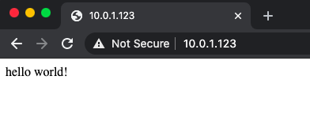

# Engineering_4_Notebook
Engineering 4 repo
## Python Assignments

### Hello Python

#### Description
In this assignment, we created a simple [dice rolling program](https://github.com/omckenn37/Engineering_4_Notebook/blob/main/Python/dice_roller.py).

Here is a screenshot of this program in action:


#### Lessons Learned

This assignment was pretty easy. It involved a while loop with a couple of if statements to check what the users's input was. For whatever reason, the one time I screenshot my output it happened to randomly select to print two sixes then two twos then two fours in a row.

### Calculator
#### Description
In this assignment, we created a simple [calculator](https://github.com/omckenn37/Engineering_4_Notebook/blob/main/Python/Calculator.py) function that does different operations to the two input numbers. 

Here is a screenshot of this program in action:


#### Lessons Learned

One issue that I had when trying to code this was the "can't concatenate str and int objects" error. I realized that I was getting this error because I was trying to print both a string and an integer in the same line. I fixed this by making my doMath() function return a string instead of an int. This made the print statement contain the same type, so I no longer had an error. 
Also, through these assignments, I think I'm getting better at using git commands. I finally understand when and how to add, commit, and push files which has been pretty helpful. 

### Quadratic Solver
#### Description
In this assignment, we created a [quadratic calculator](https://github.com/omckenn37/Engineering_4_Notebook/blob/main/Python/quadratic_solver.py) to find the roots for any given quadratic. The program either returns two real roots or returns that there are no real roots. 

Here is a screenshot of this program in action:


The first quadratic has two real roots, 2 and -2, while the second quadratic had no real roots. 

#### Lessons Learned

When coding this assignment I tried to create the least amount of variables possible. This is why in my function solve(), I only have one list called roots which either gets set to the two roots or two strings which says there are no roots. One issue I had was accessing the contents of the list once it had been returned from my solve() function. I realized that by adding a [0] or a [1] at the end of the called function, I could access either the 1st or 2nd element of that list. This helped me print out the correct values. 

### Strings and Loops
#### Description

In this assignment, we created a [program which takes in a string and prints out each letter in that string](https://github.com/omckenn37/Engineering_4_Notebook/blob/main/Python/string_splitter.py). It also prints a minus sign for every whitespace in that string.

Here is a screenshot of this program in action:


#### Lessons Learned

There were a bunch of different ways that this assignment could have been completed. You could have actually gotten the same result without using any lists at all. In python, you are able to print out specific letters in a string which in a way defeats the purpose of converting the string to a list. In my version, I opted to convert my string into a list anways and then used a for loop to print each element in that list. To convert the whitespaces to minus signs, I used the replace() function in python which takes two parameters: the string you want replaced and what you will replace it with. I had used this before, but this assignment reminded me that in order to use it you have to make a new variable or set your previous variable equal to itself in order for the replace() function to work. 

### Hangman
#### Description

In this assignment, we created a 2 player [hangman program](https://github.com/omckenn37/Engineering_4_Notebook/blob/main/Python/hangman.py). Player 1 picks a word while player 2 tries to guess the word. 

#### Pictures 

Here's what happens when player 2 guesses the right letters and wins the game:


Here's the picture of Graham that is printed once you guess 5 wrong letters, as well as the image it is based off of; if you lean back and squint, it does actually kind of look like Graham.

<p float="left">
  
  
</p>

The program also prints sections of the [graham.txt](https://github.com/omckenn37/Engineering_4_Notebook/blob/main/Python/graham.txt) file every time player 2 guesses wrong, it was just hard to screenshot so I only included the final product.

#### Lessons Learned

This assignment was definitely harder than the others. It was quite a bit longer than the others and involved for loops, if statements, lists, strings, and a  bunch of ther stuff. For me, the biggest problem I ran into was trying to find all indices of a letter in the word. For example, words like "cool" or "letter" contain multiple instances of the same letter. The issue was that the code I had written only recognized the first instance of this letter, which would ruin the program becuase the second instance of that letter would essentially be unguessable making the game go on forever. I solved this problem by changing my index variable to a list and using enumerate() to find all instances of the letter. 

For this assignment, I also decided to use a text file to print a picture rather than make an array or list and print sections of that. I figured it would be easier and cleaner to use a text file, plus it was easier to make this text file anything that I wanted it to be. I used a [image to ASCII converter](https://manytools.org/hacker-tools/convert-images-to-ascii-art/) to convert the picture of Graham into ASCII characters that could be printed in a terminal window. Once I had this file, I added it to my Python folder via file upload and pulled those changes to my pi so the file was on my pi. After that, all I had to do was figure out how to use the built in text file commands that python has such as open() and readline().

## GPIO Assignments

### SSH

#### Description

In this assignment, I connected to my pi via SSH. 

Here is a picture of my wiring:


#### Lessons Learned

This assignment was super helpful because it showed me how to access my pi without having to deal with the uart cable. Now I can also put my pi anywhere that I want and still be able to access it. All I had to do was enable SSH on my pi, get the ip, and the connect to it in a seperate terminal window. Once I was connected I ran this simple [led blink](https://github.com/omckenn37/Engineering_4_Notebook/blob/main/Python/led_blink.py) program to make sure everything was working properly.

### Bash

#### Description

In this assignment, I created a [blink.sh](https://github.com/omckenn37/Engineering_4_Notebook/blob/main/Python/blink.sh) bash file to blink two LED's on and off 10 times.

I started by using the command line commands. First I used `gpio mode 29 out` to set 29 as an output. Then, I used `gpio write 29 1` to set that pin to high and `gpio write 29 0` to set the pin to low. 
With that done, I just had to figure out how to do it in a bash file. I created a .sh file and put in a simple for loop which ran 10 times. Then, I had to find a way to blink an led in the bash file. Using [this website](https://www.teknotut.com/en/first-raspberry-pi-project-blink-led/#Blink_Project), I was able to figure out how to do this in a bash file. Also, instead of using two pins for the two different LEDs I just opted to wire both to the same pin for simplicity. I ended up with this code:
```python3
#!/bin/bash

for i in {1..20} # for loop that runs 20 times
do	
	# for simplicity, I wired both LED's to one pin
	/usr/bin/gpio toggle 29 # this toggles gpio29 on and off
	sleep .5	
done
```

#### Lessons Learned

This assignment was a lot more difficult than I initially expected it to be. I had some difficulty just running the command line commands; I think this was because I kept confusing the physical pin with the gpio pin and vice versa. After finally getting that to work, I tried using those commands in the bash file. Obviously that didn't work. After looking on the internet for a while, I came across the previously linked website. This was super helpful because it outlined pretty much the exact thing I was trying to do. After finding this, it was smooth sailing. The only other issue I had was the LEDs not blinking enough. When the for loop ran 10 times, they would only blink 5 times. I quickly realized this was because the toggle command just toggles to the opposite state that the pin is currently at. So, this means that for every 2 times through the loop, there is only one blink. All I did was change the loop to run 20 times and I was done. 

### GPIO Pins

#### Description

In this assignment, I created a simple [python script that blinks two LEDs](https://github.com/omckenn37/Engineering_4_Notebook/blob/main/Python/led_blink.py) 10 times.

This assignment was pretty simple. I just wired up two LEDs to different pins a wrote a simple script to blink them a few times. In the code, I created list `leds = [38, 40]` which stored two gpio pins. Then, I found out that you could set two different pin outputs in one line with `GPIO.setup(leds, GPIO.OUT)`. This kept me from having to make seperate lines to turn each led off and on. 

This allowed for the main loop of my code to look like this:
```python3
for i in range(0, 10): # blinks the LED's 10 times
	GPIO.output(leds, 1)
	time.sleep(0.5)
	GPIO.output(leds, 0)
	time.sleep(0.5)
```

#### Lessons Learned

One weird thing that has happened a few times are the warning messages that you ocasionally get when running python scripts that use GPIO pins. They don't actually stop the file from running, but can be kind of annoying especially if you are trying to print out other stuff in the terminal. This seems to happen after I have used ctrl + c to stop a script before it is completely finished. The messages basically tell you that those pins are already in use, which isn't actually true but the pi thinks that they are still in use because it never got to finish running the script. To fix this, I used the `GPIO.setwarnings(False)` command which turns off the warnings. 

### I2C

#### Description

In [this assignment](https://github.com/omckenn37/Engineering_4_Notebook/blob/main/Python/i2c.py), I used the SDA and SCL pins on my raspberry pi to get data from an accelerometer and display it on a SSD1306 Oled display. This is called i2c communication because it enables multiple devices to be run on just two pins, those being the SDA (serial data) and SCL (serial clock) pins. 

This assignment took a bit of time. The main struggle was figuring out all of the display commands and initial setup. To figure this stuff out, I pretty much relied on the shapes.py file that was in the examples folder in the display library. By looking at the setup that was included in that file, I figured out what I needed to have in my code. Once I had that stuff down, it was just a matter of formatting the text so that it looked good and displayed the correct values. 
To keep my acceleration values up to date, I sort of "refreshed" that portion of the screen each time the loop runs. To do this, I just printed a black rectangle over the old values and then displayed the new values in the exact same spot:

```python
draw.rectangle((100, 12, 55, 50), outline=0, fill=0) # "refreshes" the xyz values so they can be updated
disp.image(image)
disp.display()
```

This keeps the acceleration values up to date. 

#### Lessons Learned

One useful python feature that was useful when printing the text was the `.format()` command. This helped me print my values without having to do the weird "+" in between strings and floats. Here is my exact usage of this feature:
```python
draw.text((x, top + 10), "Accel x ={0}".format(round(accel_x / 100, 3)), font=font, fill=255) # draws x 
draw.text((x, top + 20), "Accel y ={0}".format(round(accel_y / 100, 3)), font=font, fill=255) # draws y
draw.text((x, top + 30), "Accel z ={0}".format(round(accel_z / 100, 3)), font=font, fill=255) # draws z
```
My main takeaway from this assignment was how to use the oled screen and how to set it up. I learned that in order to use the display, commands like `image = Image.new('1', (width, height))` and `draw = ImageDraw.Draw(image)` are necessary. In terms of the acceleromter, the only real command that is necessary is the `accelerometer.read()` command which gets the acceleration values for x, y and z. 

### Flask

#### Description

In [this assignment](https://github.com/omckenn37/Engineering_4_Notebook/blob/main/Python/Flask/hello_world/app.py), I turned my pi into a web server. This assignment was a simple introduction to flask and the basics of how it works. Even though all we did was display hello world on a webpage, this has me a bit excited because I'm already thinking of all the cool things that could be done with this. 

Here's a screenshot of what the webpage looked like:



#### Lessons Learned

This assignment was a good introduction to flask; now, I know how to do the basic setup to make my pi a web server. What I am most interested about regarding this assignment and flask as a whole is the usage of it with the gpio pins. It would be pretty cool to be able to control the pi's gpio pins form any computer thats on the same network. I think its also cool that you could pull up this web server on multiple different computers and have the pi update the webpage on all of them. I'm not quite sure how I will implement this in my project yet, but I definitely want to use it. 
